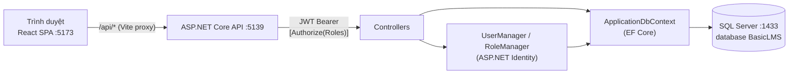
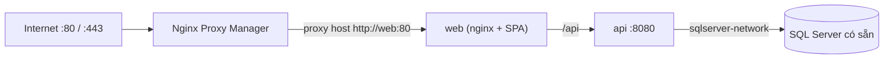
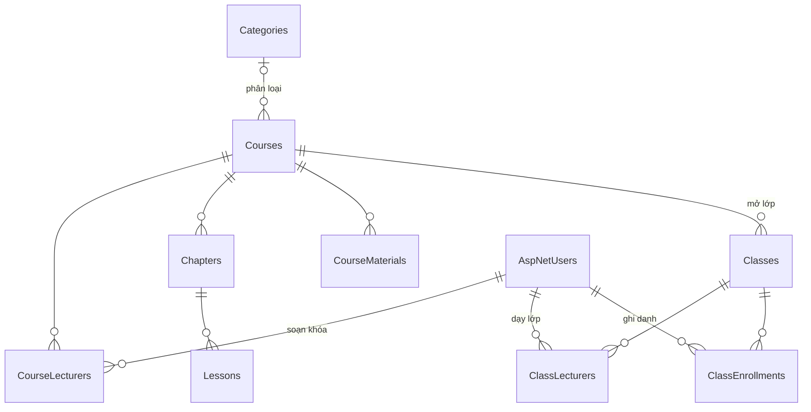

# BasicLMS

Hệ thống quản lý học tập (Learning Management System) gồm **REST API ASP.NET Core** và **SPA ReactJS**,
dữ liệu lưu trên **SQL Server**. Dự án được thiết kế theo kiến trúc tách biệt frontend/backend,
xác thực bằng JWT và phân quyền theo vai trò (Admin, Lecturer, Student).

> Tài liệu frontend chi tiết: [`ViewApp/README.md`](ViewApp/README.md).
> Context cho AI agent: [`AGENTS.md`](AGENTS.md).

## Mục lục

- [Tính năng](#tính-năng)
- [Công nghệ](#công-nghệ)
- [Kiến trúc](#kiến-trúc)
- [Cấu trúc thư mục](#cấu-trúc-thư-mục)
- [Cài đặt và chạy local](#cài-đặt-và-chạy-local)
- [Cấu hình](#cấu-hình)
- [Triển khai Linux (Docker)](#triển-khai-linux-docker)
- [API](#api)
- [Phân quyền](#phân-quyền)
- [Cơ sở dữ liệu](#cơ-sở-dữ-liệu)
- [Kiểm thử](#kiểm-thử)
- [Lộ trình phát triển](#lộ-trình-phát-triển)
- [Xử lý sự cố](#xử-lý-sự-cố)

## Tính năng

Đã hoàn thành:

- Đăng ký tài khoản (mặc định vai trò **Student**), kiểm tra độ mạnh mật khẩu ở cả client và server.
- Đăng nhập bằng email/mật khẩu, nhận JWT (hết hạn sau 60 phút); tài khoản bị khóa (`IsActive = false`) không thể đăng nhập.
- Khôi phục phiên đăng nhập khi tải lại trang, tự đăng xuất khi token hết hạn hoặc không hợp lệ.
- Dashboard với lời chào theo vai trò.
- Trang quản trị người dùng (chỉ Admin): tìm kiếm theo email/họ tên, đặt lại mật khẩu (có trình tạo mật khẩu ngẫu nhiên).
- Tự động tạo các vai trò và tài khoản Admin mặc định khi API khởi động.
- Danh mục, khóa học (chương / bài học / tài liệu URL), lớp học, phân công giảng viên, ghi danh học viên.

Chưa làm: theo dõi tiến độ bài học (`LessonProgress`) — xem [Lộ trình phát triển](#lộ-trình-phát-triển).

## Công nghệ

| Thành phần | Công nghệ                                                                                      |
| ---------- | ---------------------------------------------------------------------------------------------- |
| Backend    | ASP.NET Core Web API (.NET SDK 10, `net10.0`), ASP.NET Core Identity, JWT Bearer, Swashbuckle |
| ORM        | Entity Framework Core 10 (code-first migrations)                                               |
| Database   | SQL Server 2022 (Docker image `mcr.microsoft.com/mssql/server:2022-latest`)                    |
| Frontend   | React 19, TypeScript 6, Vite 8, Tailwind CSS v4, React Router 7, Axios                         |
| Kiểm thử   | xUnit, `Microsoft.AspNetCore.Mvc.Testing`, SQLite in-memory                                    |

## Kiến trúc



Luồng xác thực:

1. SPA gọi `POST /api/account/login` → API kiểm tra mật khẩu bằng Identity, phát hành JWT (HS256) chứa
   `NameIdentifier`, `Email`, `Name` và các claim `Role`.
2. SPA lưu token vào `localStorage` và gắn header `Authorization: Bearer <token>` cho mọi request.
3. API xác thực token (issuer, audience, chữ ký, thời hạn — không có clock skew) và kiểm tra vai trò qua `[Authorize]`.
4. Khi API trả về `401`, SPA xóa token và chuyển người dùng về trang đăng nhập.

Quy ước API:

- RESTful, prefix `/api`, route viết thường (`/api/admin/users/{id}/reset-password`).
- Body JSON dạng camelCase. Lỗi luôn có dạng
  `{ "message": "...", "errors": [{ "code": "...", "description": "..." }] }` (`errors` là tùy chọn).
- Thông báo lỗi từ API bằng tiếng Anh; frontend dịch sang tiếng Việt.

## Cấu trúc thư mục

```
BasicLMS/
├── Controllers/            # REST controllers: Account, Dashboard, Admin, LMS
├── Services/               # Category / Course / Class business logic
├── DTOs/                   # Request/response records theo từng feature
├── Data/                   # ApplicationDbContext, IdentitySeeder
├── Models/                 # ApplicationUser + LMS entities
├── Migrations/             # EF Core migrations
├── Properties/             # launchSettings.json (cổng 5139 / 7154)
├── database/               # docker-compose SQL Server + BasicLMS.sql (schema đầy đủ)
├── deploy/                 # Docker Compose cho server Linux (API, web, SQL, NPM)
├── tests/BasicLMS.Tests/   # Integration tests (xUnit)
├── ViewApp/                # React SPA
├── Program.cs              # Cấu hình DI, Identity, JWT, CORS, Swagger, seeding
├── .env.example            # Mẫu biến môi trường (copy thành .env)
├── appsettings*.json       # Cấu hình không chứa secret
├── BasicLMS.csproj
└── BasicLMS.slnx           # Solution: API + tests
```

## Cài đặt và chạy local

### Yêu cầu

- [.NET SDK 10](https://dotnet.microsoft.com/download) và công cụ EF Core: `dotnet tool install --global dotnet-ef`
- [Node.js](https://nodejs.org/) 20.19+ hoặc 22.12+ (yêu cầu của Vite 8)
- [Docker](https://www.docker.com/) (để chạy SQL Server)

### 1. Biến môi trường

```bash
cp .env.example .env
```

Điền mật khẩu SA, mật khẩu `lms_app` và `Jwt__Key` (tối thiểu 32 byte). `Program.cs` đọc `.env` khi chạy local. Biến đã có trong môi trường không bị ghi đè.

### 2. Khởi động SQL Server

```bash
docker compose --env-file .env -f database/docker-compose.yml up -d
```

Container `mssql_server` mở cổng `1433`. Mật khẩu `sa` là `MSSQL_SA_PASSWORD` trong `.env`.

### 3. Tạo database

Chọn một trong hai cách (cùng kết quả). Tài khoản `lms_app` không có quyền DDL.

Migration:

```bash
dotnet ef database update --connection "Server=127.0.0.1,1433;Database=BasicLMS;User Id=sa;Password=$MSSQL_SA_PASSWORD;TrustServerCertificate=True"
```

Hoặc script (xem `database/README.md`):

```bash
sqlcmd -S 127.0.0.1 -U sa -P "$MSSQL_SA_PASSWORD" -C -d master \
  -v AppPassword="$MSSQL_APP_PASSWORD" -i database/BasicLMS.sql
```

Script xóa và tạo lại database `BasicLMS` (Identity + LMS). `-v AppPassword` tạo login `lms_app` (đọc/ghi). Mật khẩu phải trùng `MSSQL_APP_PASSWORD` trong chuỗi kết nối.

### 4. Chạy API

```bash
dotnet run --launch-profile http
```

- API: http://localhost:5139
- Swagger UI (môi trường Development): http://localhost:5139/swagger — bấm **Authorize** và dán JWT để gọi các endpoint cần đăng nhập.

Lần chạy đầu tiên API tự tạo các vai trò `Admin`, `Lecturer`, `Student` và tài khoản quản trị:

| Email                  | Mật khẩu       | Vai trò |
| ---------------------- | -------------- | ------- |
| `admin@basiclms.local` | `Admin@123456` | Admin   |

Cùng lúc đó seed các danh mục khóa học nếu chưa có: `Programming`, `Design`, `Business`, `Language`, `Soft skills`. Mỗi khóa học bắt buộc thuộc một danh mục.

### 5. Chạy frontend

```bash
cd ViewApp
npm install
npm run dev
```

Mở http://localhost:5173. Vite proxy chuyển mọi request `/api/*` tới `http://localhost:5139`.

## Cấu hình

| Khóa                                   | Mặc định                     | Ghi chú                                                                         |
| -------------------------------------- | ---------------------------- | ------------------------------------------------------------------------------- |
| `ConnectionStrings__DefaultConnection`  | trong `.env`                 | Chuỗi kết nối SQL Server. Trống trong `appsettings.json`                        |
| `Jwt__Key`                              | trong `.env`                 | Bắt buộc, tối thiểu 32 byte; API không khởi động nếu thiếu                     |
| `Jwt__Issuer`                           | `BasicLMS`                   |                                                                                 |
| `Jwt__Audience`                         | `BasicLMS.Client`            |                                                                                 |
| `Jwt__ExpireMinutes`                    | `60`                         | Thời hạn access token (không có refresh token)                                  |
| `Seed__AdminEmail` / `Seed__AdminPassword` | trong `.env`              | Bắt buộc khi `ASPNETCORE_ENVIRONMENT=Production`. Local để trống thì dùng `admin@basiclms.local` / `Admin@123456` |

`appsettings.json` không chứa mật khẩu. File `.env` không được commit.

## Triển khai Linux (Docker)

Trên server chỉ mở 80, 443 và 81. API và frontend nằm trên network `lms` và không publish cổng ra host. Nginx Proxy Manager nhận kết nối từ internet và cấp SSL. SQL Server không được tạo bởi stack này: container `api` tham gia network có sẵn `sqlserver-network` và kết nối tới hostname `MSSQL_HOST`.



```bash
cp .env.example .env   # điền mật khẩu thật, Jwt__Key, Seed__AdminPassword
docker compose --env-file .env -f deploy/docker-compose.yml up -d --build
```

Sau khi stack lên:

1. Mở `http://<ip-server>:81`. Lần đầu đăng nhập NPM bằng `admin@example.com` / `changeme`, rồi đổi ngay.
2. Tạo Proxy Host: domain trỏ tới server, Forward Hostname `web`, Forward Port `80`, Scheme `http`. Bật Websockets không bắt buộc.
3. Tab SSL: yêu cầu chứng chỉ Let's Encrypt. DNS của domain phải trỏ tới server trước khi xin chứng chỉ.

Trình duyệt gọi cùng một origin. Nginx trong container `web` phục vụ SPA và chuyển `/api/` sang `http://api:8080`, nên không cần CORS cho domain đó.

Network `sqlserver-network` phải tồn tại trước khi `docker compose up` (SQL Server đã gắn vào network đó). `MSSQL_HOST` là tên DNS của SQL Server trên network đó, thường là tên container. Schema và login `lms_app` được tạo sẵn trên SQL Server đó bằng script trong `database/`, không phải lúc khởi động API.

## API

| Method | Endpoint                                 | Quyền         | Mô tả                                                          |
| ------ | ---------------------------------------- | ------------- | -------------------------------------------------------------- |
| POST   | `/api/account/register`                  | Public        | Đăng ký `{ fullName, email, password }`, gán vai trò Student   |
| POST   | `/api/account/login`                     | Public        | Đăng nhập `{ email, password }` → `{ token, userId, fullName, email, roles }` |
| GET    | `/api/account/me`                        | Đã đăng nhập  | Thông tin người dùng hiện tại `{ id, email, fullName, roles }` |
| GET    | `/api/dashboard/welcome`                 | Đã đăng nhập  | Lời chào theo vai trò + `serverTimeUtc`                        |
| GET    | `/api/admin/users?search=`               | Admin         | Danh sách người dùng (tối đa 100), tìm theo email/họ tên       |
| POST   | `/api/admin/users/{id}/reset-password`   | Admin         | Đặt lại mật khẩu `{ newPassword }`                             |
| GET    | `/api/users?role=&search=`               | Admin, Lecturer | Tra cứu user theo vai trò (ghi danh / phân công)             |
| GET    | `/api/categories`                        | Đã đăng nhập  | Danh sách danh mục khóa học (`courseCount`)                    |
| POST/PUT/DELETE | `/api/categories`, `/api/categories/{id}` | Admin | CRUD danh mục                                         |
| GET    | `/api/courses`                           | Đã đăng nhập  | Student chỉ thấy `Published`; Lecturer thấy Published + khóa được assign |
| GET    | `/api/courses/{id}`                      | Đã đăng nhập  | Chi tiết: chương, bài học, tài liệu, giảng viên                |
| POST   | `/api/courses`                           | Admin         | Tạo khóa học — bắt buộc `categoryId`; mặc định `Published` (`status: Draft` để tạo nháp) |
| PUT    | `/api/courses/{id}`                      | Admin / Lecturer assign | Cập nhật metadata                                    |
| PATCH  | `/api/courses/{id}/status`               | Admin / Lecturer assign | `{ status }`                                         |
| DELETE | `/api/courses/{id}`                      | Admin / Lecturer assign | 409 nếu khóa đã có lớp                               |
| POST   | `/api/courses/{courseId}/chapters`       | Admin / Lecturer assign | `{ title, sortOrder? }`                              |
| PUT/DELETE | `/api/chapters/{id}`                 | Admin / Lecturer assign |                                              |
| POST   | `/api/chapters/{chapterId}/lessons`      | Admin / Lecturer assign | `{ title, content?, videoUrl?, durationSeconds? }` |
| PUT/DELETE | `/api/lessons/{id}`                  | Admin / Lecturer assign |                                              |
| POST   | `/api/lessons/{id}/video`                | Admin / Lecturer assign | `multipart/form-data` file (mp4/webm/mov, ≤25MB) |
| GET    | `/api/lessons/{id}/video`                | Đã đăng nhập + đọc được khóa | Stream video đã tải lên                    |
| POST   | `/api/courses/{courseId}/materials`      | Admin / Lecturer assign | `{ title, url, type, lessonId? }`                    |
| POST   | `/api/courses/{courseId}/materials/upload` | Admin / Lecturer assign | `multipart/form-data` title + file (≤25MB)     |
| GET    | `/api/materials/{id}/file`               | Đã đăng nhập + đọc được khóa | Tải file học liệu                          |
| PUT/DELETE | `/api/materials/{id}`                | Admin / Lecturer assign |                                              |
| POST/DELETE | `/api/courses/{courseId}/lecturers/{userId}` | Admin | Phân công / gỡ giảng viên khóa học                    |
| GET    | `/api/classes`                           | Đã đăng nhập  | Student: lớp `Open` hoặc đã enroll                             |
| GET    | `/api/classes/{id}`                      | Đã đăng nhập  | Chi tiết lớp + danh sách ghi danh (student chỉ thấy của mình)  |
| POST/PUT/DELETE | `/api/classes`, `/api/classes/{id}` | Admin / Lecturer khóa | CRUD lớp (tạo mặc định `Open`; gửi `status: Draft` để tạo nháp) |
| POST/DELETE | `/api/classes/{classId}/lecturers/{userId}` | Admin | Phân công giảng viên lớp                           |
| POST   | `/api/classes/{classId}/enrollments`     | Student tự enroll; Admin/Lecturer enroll hộ `{ studentId }` | |
| DELETE | `/api/enrollments/{id}`                  | Chính mình / Admin / Lecturer lớp | Hủy ghi danh (status `Cancelled`)           |

Mã trạng thái: `400` dữ liệu không hợp lệ, `401` chưa đăng nhập / sai thông tin, `403` không đủ quyền,
`404` không tìm thấy, `409` email đã tồn tại.

Chính sách mật khẩu (Identity): tối thiểu 6 ký tự, có chữ hoa, chữ thường, chữ số và ký tự đặc biệt.

## Phân quyền

| Vai trò  | Được phép | Không được |
| -------- | --------- | ---------- |
| Admin    | CRUD danh mục / khóa / lớp; xuất bản; phân công giảng viên; ghi danh hộ; quản trị user | — |
| Lecturer | Xem khóa Published + khóa được assign; sửa nội dung khóa/lớp mình phụ trách; tạo lớp trên khóa được assign; ghi danh hộ vào lớp mình dạy | Tạo/xóa danh mục; tạo khóa; phân công giảng viên; xem nháp khóa/lớp không thuộc mình |
| Student  | Xem khóa Published, lớp Open (hoặc lớp đã enroll); tự ghi danh / hủy ghi danh | Mọi thao tác quản trị, tạo/sửa khóa-lớp-danh mục, xem danh sách enroll của người khác |

Tài khoản Lecturer hiện được gán vai trò thủ công (chưa có API quản lý vai trò).

## Cơ sở dữ liệu

- **Schema thực tế** do EF Core migrations quản lý (`Migrations/`): ASP.NET Identity
  (`AspNetUsers`, `AspNetRoles`, …) cộng các bảng LMS (`Categories`, `Courses`, `Chapters`,
  `Lessons`, `CourseMaterials`, `CourseLecturers`, `Classes`, `ClassLecturers`, `ClassEnrollments`).
  `AspNetUsers` có thêm `FullName`, `DateOfBirth`, `AvatarUrl`, `IsActive`, `CreatedAt`, `UpdatedAt`.
  User trong quan hệ giảng viên/học viên luôn là `AspNetUsers.Id`, không dùng bảng `Users` custom.
- API **không** tự chạy migration khi khởi động. Áp schema bằng `dotnet ef database update` hoặc script trong `database/`.
- Một file schema: `database/BasicLMS.sql` (drop/recreate). Khớp cả `InitialIdentity` và `LmsDomain`.
  Chi tiết: `database/README.md`.



Không tạo bảng `Users`/`Roles` custom. Mọi user FK trỏ `AspNetUsers`. Nếu DB cũ còn bảng draft đó, drop database rồi chạy lại hai script ở trên (hoặc `dotnet ef database update`).

## Kiểm thử

```bash
dotnet test BasicLMS.slnx
```

- 86 integration test trong `tests/BasicLMS.Tests/`, chia theo feature (`Account/`, `Admin/`, `Dashboard/`, `Lms/`).
- `CustomWebApplicationFactory` khởi tạo API thật với SQLite in-memory và JWT key riêng, nên **không cần SQL Server** khi chạy test.
- Frontend chưa có unit test; kiểm tra bằng `npm run lint` và `npm run build` trong `ViewApp/`.

## Lộ trình phát triển

- [x] Entity + migration LMS (Category, Course, Chapter, Lesson, Material, Class, assign, enroll).
- [x] Tầng `Services/` cho category / course / class.
- [x] Màn hình khóa học / lớp học cho Admin, Lecturer và Student.
- [x] Upload học liệu / video bài học (tối đa 25MB, quyền theo khóa).
- [ ] Lesson progress.
- [ ] API quản lý vai trò và khóa/mở khóa tài khoản cho Admin.
- [ ] Refresh token / lưu token an toàn hơn (HttpOnly cookie).
- [ ] Pipeline CI chạy test, lint và build.
- [ ] Dọn các file còn sót từ template MVC (`wwwroot/`, `Models/ErrorViewModel.cs`).

## Xử lý sự cố

| Triệu chứng                                                      | Cách xử lý                                                                                       |
| ---------------------------------------------------------------- | ------------------------------------------------------------------------------------------------ |
| API dừng ngay với `Jwt:Key is missing or shorter than 32 bytes`  | Tạo `.env` từ `.env.example` và đặt `Jwt__Key` dài ít nhất 32 byte                              |
| `Login failed for user 'lms_app'` / `Cannot open database`       | Chưa chạy `database/BasicLMS.sql` với `-v AppPassword=...`                                        |
| `Invalid object name 'AspNetRoles'` khi khởi động                | Database chưa có schema — chạy `dotnet ef database update --connection "<sa connection>"`         |
| Frontend báo "Không thể kết nối tới máy chủ"                      | API chưa chạy hoặc không ở cổng `5139` (kiểm tra `ViewApp/vite.config.ts`)                       |
| Lỗi CORS khi gọi API trực tiếp từ origin khác                    | Thêm origin vào policy `Frontend` trong `Program.cs`, hoặc gọi qua Vite proxy                    |
| Container SQL Server không chạy trên Apple Silicon               | Image chạy qua emulation `linux/amd64`; bật Rosetta trong Docker Desktop                          |
