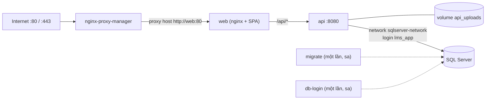

# Triển khai production (Docker)

Hướng dẫn chạy BasicLMS trên một server Linux bằng Docker Compose: cấu hình, khởi tạo database,
seed dữ liệu, SSL, cập nhật phiên bản và sao lưu. Mọi lệnh chạy từ **thư mục gốc repo**.

## Mục lục

- [Thành phần](#thành-phần)
- [Yêu cầu server](#yêu-cầu-server)
- [Cấu hình `.env`](#cấu-hình-env)
- [SQL Server](#sql-server)
- [Khởi tạo lần đầu](#khởi-tạo-lần-đầu)
- [Seed dữ liệu](#seed-dữ-liệu)
- [Domain và SSL (Nginx Proxy Manager)](#domain-và-ssl-nginx-proxy-manager)
- [Cập nhật phiên bản](#cập-nhật-phiên-bản)
- [Sao lưu và khôi phục](#sao-lưu-và-khôi-phục)
- [Vận hành hằng ngày](#vận-hành-hằng-ngày)
- [Checklist bảo mật](#checklist-bảo-mật)
- [Xử lý sự cố](#xử-lý-sự-cố)

## Thành phần



| File | Nội dung |
| --- | --- |
| `deploy/docker-compose.yml` | Stack chính (project `basiclms`): `api`, `web`, `nginx-proxy-manager` + 2 công cụ chạy một lần `migrate`, `db-login` (profile `tools`) |
| `deploy/docker-compose.sqlserver.yml` | Tùy chọn: SQL Server 2022 (project `basiclms-db`) cho server chưa có sẵn SQL Server |
| `deploy/api.Dockerfile` | Stage `runtime` (API, chạy user non-root) và `migrator` (EF Core migrations bundle) |
| `deploy/web.Dockerfile`, `deploy/nginx.conf` | Build SPA, nginx phục vụ file tĩnh và proxy `/api/` sang `api:8080` (cho phép body tới 30 MB) |
| `deploy/sql/create-app-login.sql` | Tạo/cập nhật login `lms_app` (chỉ `db_datareader` + `db_datawriter`), idempotent |

Chỉ Nginx Proxy Manager publish cổng (`80`, `443`, `81`). `api` và `web` chỉ nằm trong network
nội bộ `lms`. Trình duyệt gọi SPA và API cùng một origin nên không cần cấu hình CORS.

API **không** tự chạy migration khi khởi động (login `lms_app` không có quyền DDL). Schema được
áp bằng service `migrate`; seed chạy tự động mỗi lần API khởi động.

## Yêu cầu server

- Linux x86_64 (khuyến nghị). Image SQL Server chỉ có bản `linux/amd64`; trên ARM64 phải chạy qua
  emulation, chậm và không được Microsoft hỗ trợ.
- Docker Engine 24+ và Docker Compose v2 (`docker compose version`).
- RAM: tối thiểu 2 GB cho SQL Server + khoảng 0.5 GB cho phần còn lại.
- Firewall mở `80`, `443`. Cổng `81` (giao diện NPM) chỉ nên mở cho IP quản trị.
- Một domain có bản ghi DNS `A` trỏ về IP server (để xin chứng chỉ Let's Encrypt).

## Cấu hình `.env`

```bash
git clone <repo> basiclms && cd basiclms
cp .env.example .env
chmod 600 .env
```

Sinh secret ngẫu nhiên:

```bash
openssl rand -base64 48   # Jwt__Key
openssl rand -base64 24 | tr -d "/+=" | sed 's/$/aA1!/'   # mật khẩu SQL / admin (đủ chữ hoa, thường, số, ký tự đặc biệt)
```

| Biến | Bắt buộc | Mặc định | Ghi chú |
| --- | --- | --- | --- |
| `MSSQL_HOST` | Có | — | Tên DNS của SQL Server trên network `sqlserver-network` (dùng `sqlserver` nếu chạy `docker-compose.sqlserver.yml`) |
| `MSSQL_DATABASE` | Không | `BasicLMS` | Tên database |
| `MSSQL_SA_PASSWORD` | Khi khởi tạo/cập nhật | — | Chỉ `migrate`, `db-login` và container SQL Server dùng. API không bao giờ nhận biến này |
| `MSSQL_APP_PASSWORD` | Có | — | Mật khẩu login `lms_app` mà API dùng |
| `MSSQL_PID` | Không | `Express` | Edition khi dùng `docker-compose.sqlserver.yml`. `Developer` **không** được phép dùng cho production; dùng `Standard`/`Enterprise` nếu có license |
| `Jwt__Key` | Có | — | ≥ 32 byte. Đổi key sẽ làm mọi phiên đăng nhập hiện tại hết hiệu lực |
| `Jwt__Issuer` / `Jwt__Audience` | Không | `BasicLMS` / `BasicLMS.Client` | |
| `Jwt__ExpireMinutes` | Không | `60` | Không có refresh token; hết hạn thì đăng nhập lại |
| `Seed__AdminEmail` | Không | `admin@basiclms.local` | Email tài khoản Admin được seed |
| `Seed__AdminPassword` | Có | — | API từ chối khởi động ở Production nếu trống. Phải đạt policy: ≥ 6 ký tự, có chữ hoa, chữ thường, số, ký tự đặc biệt |

`ConnectionStrings__DefaultConnection` và `Storage__Root` trong `.env` chỉ dùng cho `dotnet run`
local; compose tự dựng chuỗi kết nối từ các biến `MSSQL_*` và lưu file upload ở `/app/uploads`
(volume `api_uploads`).

Ràng buộc mật khẩu SQL:

- Policy SQL Server: ≥ 8 ký tự và có ít nhất 3 trong 4 nhóm (hoa, thường, số, ký tự đặc biệt).
- Không dùng `;` (phá chuỗi kết nối), `'` (phá script tạo login) và `$` (Compose hiểu là biến; nếu
  bắt buộc thì viết `$$`).

Compose dừng ngay với thông báo `... is required` nếu thiếu biến bắt buộc. Kiểm tra cấu hình
cuối cùng (có in ra secret, đừng chia sẻ output):

```bash
docker compose --env-file .env -f deploy/docker-compose.yml config
```

## SQL Server

Stack chính cần một SQL Server gắn vào Docker network `sqlserver-network`. Chọn một trong hai:

**A. Đã có SQL Server chạy bằng Docker trên cùng server**

```bash
docker network create sqlserver-network               # nếu chưa có
docker network connect sqlserver-network <container-sql>
```

Đặt `MSSQL_HOST=<container-sql>` và `MSSQL_SA_PASSWORD` (hoặc một login có quyền `dbcreator` +
`securityadmin`) trong `.env`.

**B. Chưa có — dùng file compose kèm theo**

```bash
docker compose --env-file .env -f deploy/docker-compose.sqlserver.yml up -d
docker compose -f deploy/docker-compose.sqlserver.yml ps   # chờ trạng thái healthy
```

Đặt `MSSQL_HOST=sqlserver`. Dữ liệu nằm trong volume `basiclms-db_mssql_data`. Cổng `1433` chỉ
bind vào `127.0.0.1` để công cụ trên host dùng được; xóa mục `ports` nếu không cần.

## Khởi tạo lần đầu

```bash
# 1. Build image
docker compose --env-file .env -f deploy/docker-compose.yml --profile tools build

# 2. Tạo database + toàn bộ schema (EF Core migrations, chạy bằng sa)
docker compose --env-file .env -f deploy/docker-compose.yml --profile tools run --rm migrate

# 3. Tạo login lms_app cho API (đọc/ghi, không DDL)
docker compose --env-file .env -f deploy/docker-compose.yml --profile tools run --rm db-login

# 4. Chạy stack; API seed vai trò, admin, danh mục khi khởi động
docker compose --env-file .env -f deploy/docker-compose.yml up -d

# 5. Kiểm tra
docker compose --env-file .env -f deploy/docker-compose.yml ps
docker compose --env-file .env -f deploy/docker-compose.yml logs api --tail 50
```

`migrate` in danh sách migration đã áp (`InitialIdentity`, `LmsDomain`, …) và kết thúc bằng `Done.`;
`db-login` in `Login lms_app is ready on BasicLMS.`. `api` và `web` phải ở trạng thái `healthy`.

Cả hai lệnh ở bước 2 và 3 đều idempotent: chạy lại không mất dữ liệu.

Không dùng `database/BasicLMS.sql` trên production đang có dữ liệu: script đó **drop và tạo lại**
database. Nó chỉ phù hợp cho máy dev hoặc server trống.

Sau khi khởi tạo xong, có thể xóa `MSSQL_SA_PASSWORD` khỏi `.env` trên server và chỉ thêm lại
khi cần chạy `migrate`/`db-login` (riêng phương án B, container SQL Server chỉ đọc biến này ở lần
khởi tạo volume đầu tiên).

## Seed dữ liệu

Seed nằm trong `Data/IdentitySeeder.cs`, chạy **mỗi lần API khởi động**, trước khi nhận request.
Mọi bước đều idempotent (chỉ thêm cái còn thiếu), nên restart API không tạo bản ghi trùng.

| Dữ liệu | Hành vi |
| --- | --- |
| Vai trò `Admin`, `Lecturer`, `Student` | Tạo nếu chưa có |
| Tài khoản Admin (`Seed__AdminEmail`) | Chưa có → tạo với `Seed__AdminPassword`, họ tên `System Administrator`. Đã có → chỉ bật lại `IsActive`, `EmailConfirmed` và đảm bảo có vai trò Admin; **không** đổi mật khẩu |
| Danh mục khóa học | `Programming`, `Design`, `Business`, `Language`, `Soft skills` — thêm danh mục nào chưa có (so theo tên) |

Chạy lại seed:

```bash
docker compose --env-file .env -f deploy/docker-compose.yml restart api
docker compose --env-file .env -f deploy/docker-compose.yml logs api --tail 50
```

Seed lỗi thì API dừng (container restart liên tục) và log ghi rõ nguyên nhân, ví dụ
`Seed:AdminPassword is required when ASPNETCORE_ENVIRONMENT is Production` hoặc
`Seed:AdminPassword does not meet the Identity policy ...`.

Lưu ý:

- **Đổi mật khẩu Admin**: đổi `Seed__AdminPassword` sau lần chạy đầu *không* có tác dụng. Đăng nhập
  bằng Admin và dùng trang **Quản trị người dùng → Đặt lại mật khẩu** (áp dụng được cho chính mình).
  Sau đó xóa hoặc thay `Seed__AdminPassword` trong `.env` bằng giá trị ngẫu nhiên khác.
- **Quên mật khẩu Admin**: đặt `Seed__AdminEmail` sang một email mới chưa tồn tại, đặt
  `Seed__AdminPassword`, rồi `up -d` lại API — seed tạo thêm một Admin mới. Dùng Admin mới để đặt lại
  mật khẩu tài khoản cũ.
- **Danh mục mặc định bị xóa/đổi tên** sẽ được tạo lại ở lần khởi động sau (seed so theo tên).
- **Cấp vai trò Lecturer**: chưa có API quản lý vai trò. Người dùng tự đăng ký (vai trò Student),
  sau đó Admin chạy SQL (service `db-login` có sẵn `sqlcmd` và mật khẩu `sa`; thay `sqlserver` bằng
  `MSSQL_HOST` và email cần cấp):

  ```bash
  docker compose --env-file .env -f deploy/docker-compose.yml --profile tools run --rm db-login \
    -S sqlserver,1433 -U sa -C -b -d BasicLMS -Q "
    INSERT INTO AspNetUserRoles (UserId, RoleId)
    SELECT u.Id, r.Id FROM AspNetUsers u CROSS JOIN AspNetRoles r
    WHERE u.NormalizedEmail = UPPER(N'giangvien@example.com') AND r.NormalizedName = N'LECTURER'
      AND NOT EXISTS (SELECT 1 FROM AspNetUserRoles ur WHERE ur.UserId = u.Id AND ur.RoleId = r.Id);"
  ```

  Người dùng phải đăng nhập lại để JWT có vai trò mới.

## Domain và SSL (Nginx Proxy Manager)

1. Mở `http://<ip-server>:81`, đăng nhập lần đầu bằng `admin@example.com` / `changeme` và đổi ngay.
2. **Hosts → Proxy Hosts → Add Proxy Host**: Domain Names = domain của bạn, Scheme `http`,
   Forward Hostname `web`, Forward Port `80`. Bật *Block Common Exploits*.
3. Tab **SSL**: *Request a new SSL Certificate*, bật *Force SSL* và *HTTP/2 Support*.
   DNS phải trỏ về server trước bước này.
4. Tab **Advanced** → *Custom Nginx Configuration*, để upload học liệu tối đa 25 MB:

   ```nginx
   client_max_body_size 30m;
   ```

5. Sau khi có SSL, chặn cổng `81` từ internet (firewall) hoặc tạo proxy host riêng có Access List
   cho chính giao diện NPM.

Dùng reverse proxy khác (Caddy, Traefik, nginx của host) cũng được: trỏ vào container `web:80`
trong network `lms` và cho phép body ≥ 30 MB. Khi đó xóa service `nginx-proxy-manager`.

## Cập nhật phiên bản

```bash
git pull
docker compose --env-file .env -f deploy/docker-compose.yml --profile tools build
docker compose --env-file .env -f deploy/docker-compose.yml --profile tools run --rm migrate
docker compose --env-file .env -f deploy/docker-compose.yml up -d
docker image prune -f
```

Luôn chạy `migrate` trước `up -d` khi bản mới có migration. Nên sao lưu database trước (mục dưới).
Seed tự chạy lại khi container `api` được tạo lại.

Nếu server đã chạy bản compose cũ (trước khi file có `name: basiclms`), volume của bạn mang tiền tố
`deploy_` (`deploy_api_uploads`, `deploy_npm_data`, …). Thêm `-p deploy` vào mọi lệnh
`docker compose` để tiếp tục dùng các volume đó. Volume upload tạo bởi bản cũ thuộc `root`, còn
API giờ chạy non-root, nên cấp lại quyền một lần:

```bash
docker run --rm -v deploy_api_uploads:/data alpine chown -R 1654:1654 /data
```

## Sao lưu và khôi phục

Cần sao lưu **cả hai**: database và volume file upload (`basiclms_api_uploads`).

Database — ví dụ dùng phương án B (container `sqlserver`, đã có sẵn biến `MSSQL_SA_PASSWORD` bên
trong). Express không hỗ trợ `WITH COMPRESSION`:

```bash
docker exec sqlserver bash -c '/opt/mssql-tools18/bin/sqlcmd -S localhost -U sa -C -b \
  -P "$MSSQL_SA_PASSWORD" \
  -Q "BACKUP DATABASE [BasicLMS] TO DISK = N'"'"'/var/opt/mssql/data/BasicLMS.bak'"'"' WITH INIT"'
docker cp sqlserver:/var/opt/mssql/data/BasicLMS.bak ./BasicLMS-$(date +%F).bak
```

File upload:

```bash
docker run --rm -v basiclms_api_uploads:/data:ro -v "$PWD":/backup alpine \
  tar czf /backup/uploads-$(date +%F).tgz -C /data .
```

Khôi phục:

```bash
docker compose --env-file .env -f deploy/docker-compose.yml stop api
docker cp ./BasicLMS-2026-10-07.bak sqlserver:/var/opt/mssql/data/restore.bak
docker exec sqlserver bash -c '/opt/mssql-tools18/bin/sqlcmd -S localhost -U sa -C -b \
  -P "$MSSQL_SA_PASSWORD" \
  -Q "RESTORE DATABASE [BasicLMS] FROM DISK = N'"'"'/var/opt/mssql/data/restore.bak'"'"' WITH REPLACE"'
docker run --rm -v basiclms_api_uploads:/data -v "$PWD":/backup alpine \
  sh -c "tar xzf /backup/uploads-2026-10-07.tgz -C /data && chown -R 1654:1654 /data"
docker compose --env-file .env -f deploy/docker-compose.yml --profile tools run --rm db-login
docker compose --env-file .env -f deploy/docker-compose.yml up -d
```

`db-login` sau khi restore nối lại user `lms_app` trong database với login trên server (tránh lỗi
orphaned user khi restore sang server khác).

## Vận hành hằng ngày

Mọi lệnh `docker compose` phải kèm `--env-file .env`: Compose chỉ tự đọc `.env` nằm cạnh file
compose (`deploy/`), còn file của dự án nằm ở thư mục gốc. Đặt alias cho gọn:

```bash
alias lms='docker compose --env-file .env -f deploy/docker-compose.yml'
```

| Việc | Lệnh |
| --- | --- |
| Trạng thái + health | `lms ps` |
| Log API | `lms logs -f api` |
| Health check thủ công | `curl https://<domain>/api/health` → `Healthy` (kiểm tra cả kết nối database) |
| Restart API (chạy lại seed) | `lms restart api` |
| Dừng stack (giữ dữ liệu) | `lms down` |

Log container được xoay vòng (3 file × 10 MB mỗi service). Swagger tắt ở Production.

## Checklist bảo mật

- [ ] `.env` có quyền `600`, không commit, secret khác hoàn toàn so với `.env.example`.
- [ ] `Jwt__Key` ngẫu nhiên ≥ 32 byte; `Seed__AdminPassword` được đổi sau lần đăng nhập đầu.
- [ ] Đã đổi tài khoản mặc định của Nginx Proxy Manager; cổng `81` không mở ra internet.
- [ ] Bật *Force SSL*; chỉ `80`/`443` mở công khai. SQL Server không publish ra ngoài `127.0.0.1`.
- [ ] API dùng `lms_app` (không DDL); `MSSQL_SA_PASSWORD` không được truyền vào container `api`.
- [ ] Có lịch sao lưu database + volume upload và đã thử khôi phục.

## Xử lý sự cố

| Triệu chứng | Nguyên nhân / cách xử lý |
| --- | --- |
| `network sqlserver-network declared as external, but could not be found` | Tạo network và gắn SQL Server vào (mục [SQL Server](#sql-server)), hoặc chạy `docker-compose.sqlserver.yml` trước |
| `required variable ... is missing a value` | Thiếu biến bắt buộc trong `.env` |
| `migrate` báo `A network-related or instance-specific error` | Sai `MSSQL_HOST` hoặc SQL Server chưa healthy / chưa gắn vào `sqlserver-network` |
| `db-login` báo `Database BasicLMS does not exist` | Chưa chạy `migrate` |
| API restart liên tục, log `Login failed for user 'lms_app'` | Chưa chạy `db-login`, hoặc `MSSQL_APP_PASSWORD` đã đổi — chạy lại `db-login` để đồng bộ mật khẩu |
| API log `Invalid object name 'AspNetRoles'` | Database chưa có schema — chạy `migrate` |
| API log `Seed:AdminPassword ...` | Xem mục [Seed dữ liệu](#seed-dữ-liệu) |
| `web` không lên, `api` ở trạng thái `unhealthy` | Xem `lms logs api` và `docker inspect --format '{{json .State.Health}}' basiclms-api-1` |
| `required variable ... is missing a value` dù `.env` đầy đủ | Quên `--env-file .env` (Compose không tự đọc `.env` ở thư mục gốc) |
| Upload báo lỗi `413 Request Entity Too Large` | Thêm `client_max_body_size 30m;` vào proxy host trong NPM (mục SSL bước 4) |
| Upload báo `Permission denied` trong log API | Volume upload cũ thuộc root — xem mục [Cập nhật phiên bản](#cập-nhật-phiên-bản) |
| `exec format error` / SQL Server rất chậm | Server ARM64; image SQL Server chỉ hỗ trợ `amd64` |
